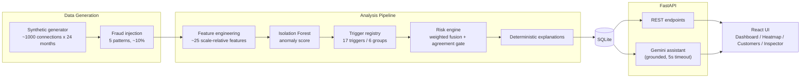
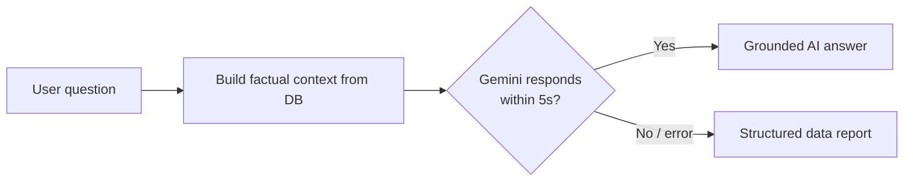

# Nero AI — Explainable Electricity-Theft Detection

Nero AI is a full-stack analytics platform that detects **non-technical losses** (electricity theft) on a power distribution grid and explains *why* every customer was flagged. It combines a registry of statistical fraud triggers with an Isolation Forest anomaly model to produce a transparent **0–100 risk score**, then surfaces the evidence through an operational dashboard, an interactive risk map, and a grounded AI investigation assistant.

The project is modelled on the grid of **Tirana, Albania**, and uses a realistic synthetic dataset of metered connections — but every detector relies only on **utility-observable data** (meter readings, billing history, and network topology), with no demographic assumptions, so the approach maps directly onto a real distribution company (e.g. OSHEE).

> Non-technical losses — meter tampering, illegal connections, and billing manipulation — cost utilities billions every year. Nero AI turns raw monthly consumption into ranked, explainable investigation leads.

---

## Highlights

- **Explainable by design** — every risk score is backed by named triggers, each emitting a human-readable reason that always matches the underlying detector.
- **Hybrid detection** — 17 statistical triggers across 6 independent groups, fused with an Isolation Forest used strictly as a corroborating signal (it can never dominate the score).
- **Multi-group agreement gate** — the score only climbs when several independent detection families concur, sharply reducing false positives.
- **Five fraud patterns** — meter tampering, illegal connections, seasonal manipulation, neighborhood anomalies, and gradual theft.
- **Grounded AI assistant** — a Gemini-powered chat that narrates the computed evidence (and only the evidence), with an automatic data-report fallback if the model is slow or unavailable.
- **Live re-analysis** — adding new meter readings or advancing a billing month retrains the model and recomputes all risk scores end-to-end.
- **Polished UI** — animated 3D globe intro, Leaflet risk map, consumption charts, and a risk gauge with a component breakdown.

---

## Tech Stack

| Layer | Technologies |
|-------|--------------|
| **Backend** | Python, FastAPI, SQLAlchemy, SQLite, Pandas, NumPy, scikit-learn (Isolation Forest), httpx |
| **Frontend** | React 19, TypeScript, Vite, Tailwind CSS v4, Framer Motion, Recharts, Leaflet, Three.js, TanStack Query, Axios |
| **AI** | Google Gemini (`gemini-2.5-flash`), strictly grounded on computed analysis data |
| **Runtime artifacts** | `data/voltguard.db` (SQLite), `models/isolation_forest.joblib` |

---

## Architecture



### How detection works

1. **Feature engineering** — ~25 scale-relative features (deviations, ratios, z-scores, curve distances) are derived per monthly reading across five families: personal history, seasonal, peer, geographic, and load-shape. Raw consumption magnitude alone is never used.
2. **Anomaly model** — an Isolation Forest (300 trees) trains on the engineered features and outputs a normalized 0–1 anomaly score.
3. **Trigger registry** — 17 vectorized triggers each score every record 0–1 and "fire" past a threshold, emitting `{ trigger_name, group, score, threshold, evidence_window, features_used, reason }`.
4. **Risk engine** — trigger groups are fused into four weighted components, gated by multi-group agreement so isolated signals are dampened.
5. **Explanations** — fired triggers are turned into deterministic, human-readable reasons that always match the detectors exactly.

### Trigger registry

| Group | Triggers |
|-------|----------|
| Self-Behavior | `sudden_drop`, `low_usage_persistence`, `volatility_anomaly` |
| Seasonal | `winter_underconsumption`, `seasonal_inconsistency`, `temperature_mismatch` |
| Peer Comparison | `peer_deviation`, `building_outlier`, `z_score_anomaly` |
| Geographic | `district_outlier`, `hotspot_cluster`, `neighborhood_divergence` |
| Meter Integrity | `flatline_usage`, `repeated_values`, `abnormal_stability` |
| Load Shape | `consumption_shape_distance`, `historical_pattern_break` |

### Risk score

The 0–100 score fuses four weighted components:

- **30%** Self-Behavior (+ Meter Integrity, with the Isolation Forest as a capped corroborating signal)
- **25%** Seasonal
- **25%** Peer Comparison
- **20%** Geographic + Load Shape

A **multi-group agreement gate** scales the raw score by how many independent trigger groups fire (3+ groups = full weight, 2 = 0.85, 1 = 0.40, 0 = 0). Each customer's headline risk is the **mean of its top-3 risk months over the last 12 months** (a sustained anomaly), with the peak month supplying the evidence. Status thresholds: **Normal**, **Suspicious** (≥ 38), **Critical** (≥ 65).

---

## Dataset

A synthetic but realistic dataset is generated once on first boot:

- **~1,000 metered connections** across 10 Tirana districts (Tiranë Center, Blloku, Laprakë, Kombinat, Kinostudio, Yzberisht, Fresku, Astir, Ali Demi, Sauk).
- **24 months** of consumption per connection, driven by the canonical Tirana monthly temperature profile (Jan ~5 °C … Jul/Aug ~28 °C … Dec ~7 °C).
- **Utility-observable fields only**: `customer_id`, `contract_number`, `meter_id`, `meter_type`, `connection_type`, `building_id`, `transformer_id`, `district`, `property_type`, coordinates, and a consumption archetype. No demographic data (household size, floor area, etc.).
- Connections cluster into shared **buildings** and **transformers** for clean peer and neighborhood comparison.
- **Fraud injected into ~10%** of connections across all five patterns, with ground-truth labels used only for validation.

---

## Project Structure

```
EnergyJunction/
├── backend/
│   └── app/
│       ├── api/            # REST endpoints (customers, dashboard, heatmap, risk, ai, ...)
│       ├── dataset/        # synthetic generation + fraud injection
│       ├── features/       # ~25 engineered features (personal/seasonal/peer/geo/shape)
│       ├── triggers/       # trigger registry: 6 groups, 17 triggers
│       ├── risk_engine/    # weighted fusion + multi-group agreement gate
│       ├── ml/             # Isolation Forest train/score + model store
│       ├── explainability/ # deterministic reasons + grounded Gemini assistant
│       ├── services/       # end-to-end analysis pipeline orchestration
│       ├── db/             # SQLAlchemy models + session
│       ├── schemas/        # Pydantic request/response models
│       └── utils/          # Tirana geography, temperatures, archetypes
├── frontend/
│   └── src/
│       ├── pages/          # Dashboard, Heatmap, Customers, CustomerDetail, Inspector
│       ├── components/     # ai/ customer/ geo/ inspector/ layout/ ui/
│       ├── hooks/          # React Query data hooks
│       ├── api/            # axios client + endpoint map
│       └── lib/            # risk colors, formatters
├── models/                 # trained Isolation Forest artifact (generated)
├── requirements.txt
└── README.md
```

---

## Getting Started

### Prerequisites

- Python 3.11+
- Node.js 18+

### 1) Install dependencies

```bash
python -m pip install --user -r requirements.txt
cd frontend && npm install
```

### 2) (Optional) Enable the Gemini assistant

Copy the example env file and add your key — without it, the assistant automatically falls back to a deterministic, data-grounded report.

```bash
cp backend/.env.example backend/.env
# then set GEMINI_API_KEY in backend/.env
```

### 3) Start the backend (from the repo root)

```bash
python -m uvicorn app.main:app --app-dir backend --host 127.0.0.1 --port 8000 --reload
```

On first boot the backend generates the dataset, trains the model, and runs the full analysis automatically (~40s). Subsequent boots reuse the persisted data. Backend: `http://localhost:8000`.

### 4) Start the frontend

```bash
cd frontend && npm run dev
```

Frontend: `http://localhost:5173`. The Vite dev server proxies API calls to the backend, so no CORS setup is needed.

> **Open on other devices (same LAN):** the dev server binds to all interfaces and prints a Network URL (e.g. `http://192.168.1.42:5173`). To point the proxy at a custom backend port, set `VITE_API_PROXY_TARGET=http://127.0.0.1:8000` in `frontend/.env`.

---

## Application Pages

- **Dashboard** — KPIs (total customers, high-risk count, estimated losses, anomalies), top-10 high-risk customers, a risk-distribution donut, and risk-by-district bars.
- **Heatmap** — an animated 3D globe zooms into Tirana, then cross-fades into a Leaflet risk map of flagged connections. Clicking a marker opens a focus card with the risk score and reason, plus an **Investigate with AI** chat.
- **Customers** — a searchable grid of customer cards; the detail view shows the profile, an AI summary, a risk gauge with a hover breakdown, a consumption chart with anomaly months highlighted, and the trigger explainability checklist.
- **Inspector** — the operational queue of open high-risk cases: review a profile, mark it **Fraud / Resolved**, add a next-month reading for one customer, bulk-upload readings (CSV/JSON), or advance the whole dataset by a month — all of which retrain the model.

---

## AI Assistant (Grounded)

The Gemini assistant may **only narrate or answer questions about the computed analysis data** — it never computes risk, detects anomalies, or influences scoring. A strict factual context is built from the database, and the model is instructed to never invent facts.

To keep the UX responsive, the call has a **5-second timeout**. If Gemini is slow, rate-limited, errors, or is not configured, the backend instantly returns a structured **data report** built from the customer's own analysis data — so the user always gets a useful answer.



---

## API Reference

| Method | Endpoint | Description |
|--------|----------|-------------|
| `GET` | `/customers` | All connections with risk summary |
| `GET` | `/customer/{id}` | Full profile + consumption history + triggers |
| `GET` | `/risk/{id}` | Risk breakdown for one connection |
| `GET` | `/dashboard` | KPIs, top-10, district risk, trends |
| `GET` | `/heatmap` | District/building risk aggregates + hotspots |
| `POST` | `/ai/chat` | Grounded investigation chat (Gemini or data report) |
| `GET` | `/ai/summary/{id}` | One-shot AI summary for a connection |
| `POST` | `/analyze` | Re-run the full analysis pipeline |
| `POST` | `/generate-dataset` | Regenerate the synthetic dataset |
| `POST` | `/train-model` | Train the Isolation Forest only |
| `POST` | `/consumption/{id}` | Add a monthly reading (retrains) |
| `POST` | `/advance-month` | Advance all connections one month (retrains) |
| `POST` | `/bulk-upload` | Bulk-import readings via CSV/JSON (retrains) |
| `POST` | `/customer/{id}/review` | Mark a case Fraud / Resolved / open |

---

## Validation

A smoke check runs the full flow and asserts every endpoint:

```bash
cd backend && python tests/smoke_check.py
```

On a 1,000-customer / 24-month dataset, the system detects roughly **99% of injected fraud customers** (target > 90%) at a low false-positive rate, with explanations that match the fired triggers exactly.

---

## Design Principles

1. **Explainability first** — no black-box score; every flag traces back to named, human-readable evidence.
2. **Agreement over intensity** — multiple independent detection families must concur before a case escalates.
3. **ML as corroboration** — the Isolation Forest supports the statistical triggers but is capped so it cannot dominate.
4. **AI is narration-only** — the assistant explains existing analysis; it never invents findings or computes risk.
5. **Utility-realistic** — only data a distribution company actually has (meters, billing, topology) is ever used.
